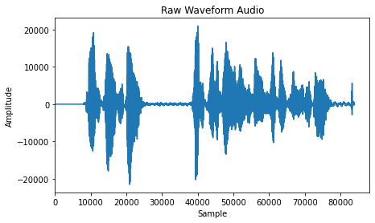
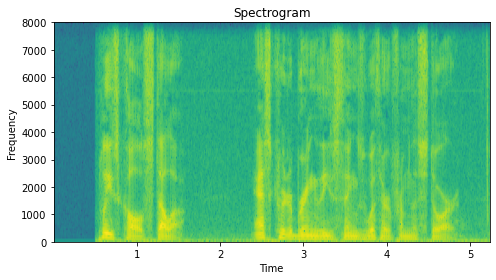
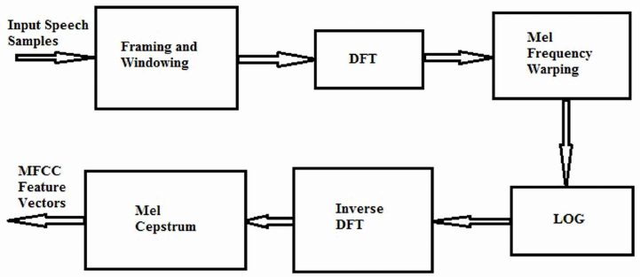
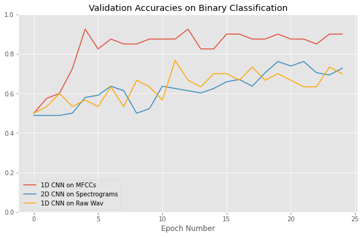
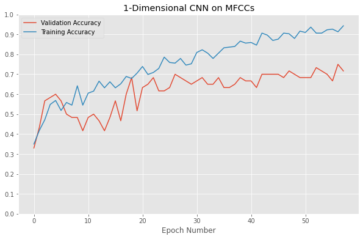

# Accent Classification with Neural Networks

## The Problem

From virtual assistants like Siri, Alexa, and Cortana to automatic closed captioning on YouTube (and soon to be, Zoom), automatic speech recognition (ASR)  systems have become increasingly present in our everyday lives. These services can be welcome conveniences for many users.

But for others, the barrier for entry can be too high. These models, trained predominantly on native English-speaking voices, can often struggle with correctly interpreting non-native English speakers. Beyond merely causing frustration, this is another example of the lack of inclusivity that all too often plagues the tech industry.

## The Proposed Solution

### A Two Step Approach

The first task in any ASR system should be to first classify a speaker’s accent. Then, rather than using a generic model for all speakers, that speech can be passed to a model that has been specifically trained to interpret that regional accent. This second model could then avoid the pitfalls of imposing a native English bias on the sounds of a non-native speaker.

The purpose of this project will be a proof of concept of the first step in this approach. Can a machine-learning model be trained to reliably identify a speaker’s native accent? What are the best approaches to maximize the effectiveness of this classification?

## The Data

The Speech Accent Archive*

- Hundreds of mp3 recordings (44.1 kHz) of a recitation of sample text
- Contains speaker’s native language, country of origin, gender, age, and age at which they began speaking English
- We’ll limit the scope to an initial binary classification task (American English vs. Spanish) and then a multi-class task (American English, Spanish, Mandarin)
- Due to relatively small sample size, audio augmentation through minor pitch shift, time shift, time stretch, and addition of noise was important

*Weinberger, Steven. (2015). Speech Accent Archive. George Mason University. Retrieved from http://accent.gmu.edu

This is the sample text recited in each of the audios:

***Please call Stella. Ask her to bring these things with her from the store: Six spoons of fresh snow peas, five thick slabs of blue cheese, and maybe a snack for her brother Bob. We also need a small plastic snake and a big toy frog for the kids. She can scoop these things into three red bags, and we will go meet her Wednesday at the train station***

## The Preprocessing Conundrum

The bulk of the work for this project was determining the most effective method for preprocessing the data. Not only could it improve the performance of the neural networks, but it effectively dictates what architectures to use based on the resulting processed data.

### Approach 1: Raw Waveform Audio with 1-D CNN

Some model architectures, like WaveNet, are intended to handle raw audio as input. In this approach, we will simply downsample the audio to 16kHz and pass it directly to a neural network with 1-dimensional convolutional layers. 1-D convolutions are a good choice for audio, as the kernels in these layers will only move in one direction (the time dimension). The major drawback of this approach is the sheer size of data in even short raw audio clips.

### Approach 2: Spectrogram Analysis with 2-D CNN

Another common approach is to convert the raw audio into spectrograms.  In this instance, the raw audio is converted using a Fast Fourier Transform (FFT), which separates its constituent frequencies and displays the amplitude of those frequencies over time. In doing so, we’ve effectively turned an audio classification task into an image classification task, to which 2-dimensional convolutional layers are very well suited.

### Approach 3: MFCCs with 1-D CNN

Mel Frequency Cepstral Coefficients are a popular method of preprocessing audio data containing human speech. Like spectrograms, it starts with a Fourier transform (of brief time windows) to break the audio into constituent frequencies. Then, the relative powers of these frequencies are mapped onto the mel scale, which effectively translates these frequencies into the human perception of pitch. After taking the log and the inverse DFT, the output becomes a series of vectors of MFCCs. The ultimate value in this preprocessing method is that it creates a series of frequency bands that more accurately represent human perception of sound .

As with our raw audio data, we can pass these feature vectors to a 1-D convolutional neural network. In this case, however, the data will have been significantly reduced to principal components, making training and optimization significantly more efficient.

## Evaluation of Binary Classification Performance

After developing and tuning each of the models separately, I finally trained and tested the best version of each model so their performances could be directly comparedon a binary classification task (American English vs. Spanish).

As we can see, the 1-D CNN trained on the MFCCs did significantly better.

Final Validation Accuracies:
 - 1D CNN on MFCCs: 92.5%
 - 1D CNN on Raw Wav: 76.67%
 - 2D CNN on Spectrograms: 76.14%

## Evaluation of Multi-Class Classification Performance

Given the solid performance on binary classification, I wanted to expand the scope of the task to better reflect the ultimate goal of the project. I took our best performing model (1D CNN using MFCCs) and trained/tested it on a dataset with a third class, Mandarin. 

